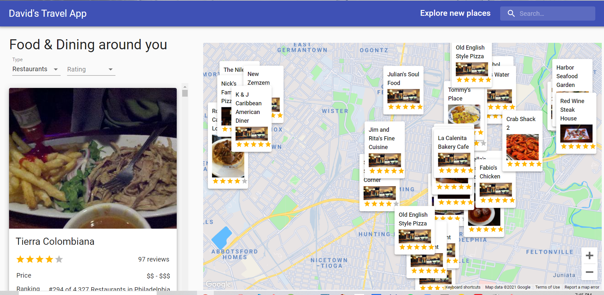
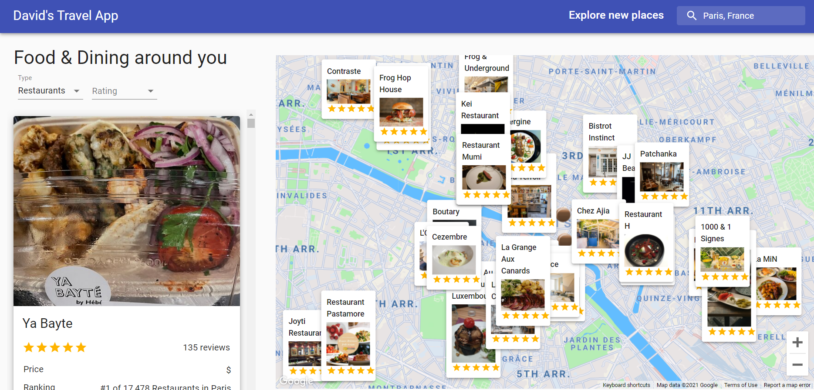
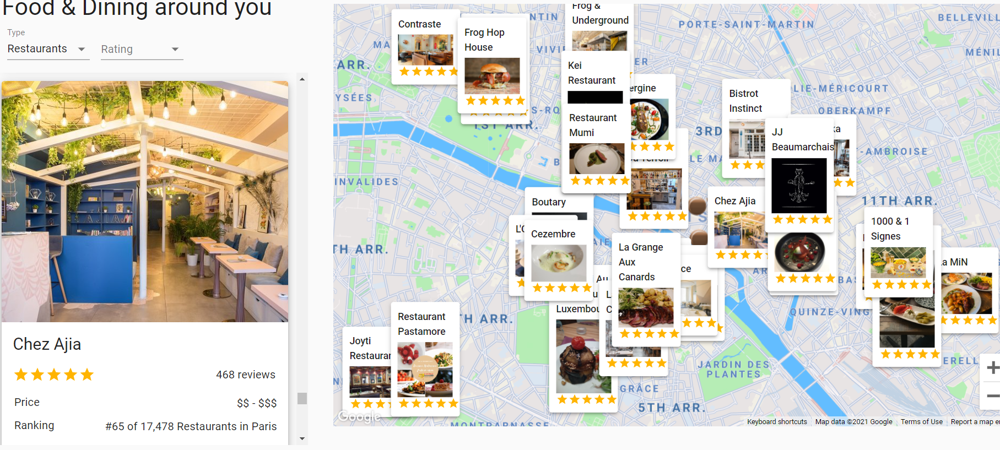
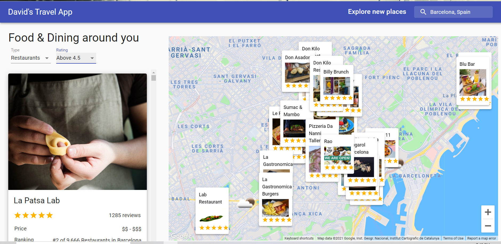

# travel-app

I made this because I wanted more experience with the Google maps api. I wouldn't have been able to do this without the experience I gained the first time I worked with the Google maps api. This project wasn't terribly difficult.

## Environment Setup

1. Clone my repo at https://github.com/davidmstanleyjr/travel-app
2. CD into it and run "npm install".
3. Then run "npm start". This opens the project at localhost:3000.
4. You will need to use your own api keys.

# Technologies Used

1. React
2. Material UI
3. Material UI icons
4. Google Maps API
5. Google Maps Places
6. Axios
7. Google Map React
8. Rapid API
9. Travel Advisor API
10. Open Weather Map API

## Issues

I didn't have too many issues with this one but writing the longitude and latitude logic was kind of tough. It was super important that I got that right because everything that would populate the page was dependent upon it.

Also, the placedetails logic was kind of hard because it needed to be imported into other files and those files were dependent on it. List.js was hard to because it populated everything on the left side of the screen.

The travelAdvisorAPI was tricky because i've never used it. I had to query it in the RapidApi website and look at the results in order to know what the info the API returned and how to write it. The weather api wasn't difficult because I just used the same logic from the traveladvisor api code.

The search logic wasn't difficult. I used an onload event and autocomplete and everything just fell into place. Google makes it easy to implement that logic.

Map styles.js comes from a website that allows you to beautify your maps. It's pretty cool. It's called Snazzy maps.

## Screenshots

## Live Page

Here is a link to the deployed app https://davids-travel.vercel.app/

I hope you have fun with it.
